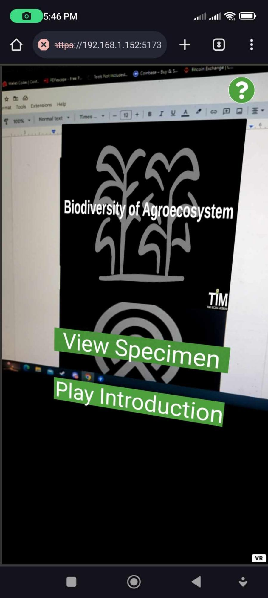
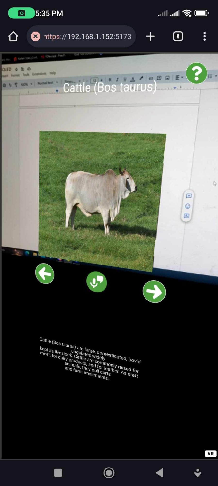

# ARchive
---
ARchive is an augmented reality web application built on React and TailwindCSS with the help of [mind-ar](https://github.com/hiukim/mind-ar-js) that offers the user text-to-speech functionality for guidance and a real-time
access to the vastly different specimen offered by ICCEM
---

